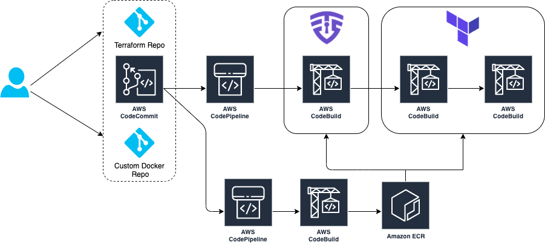
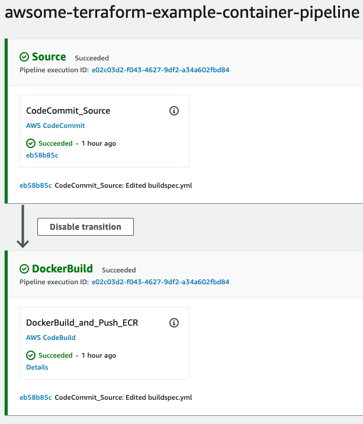
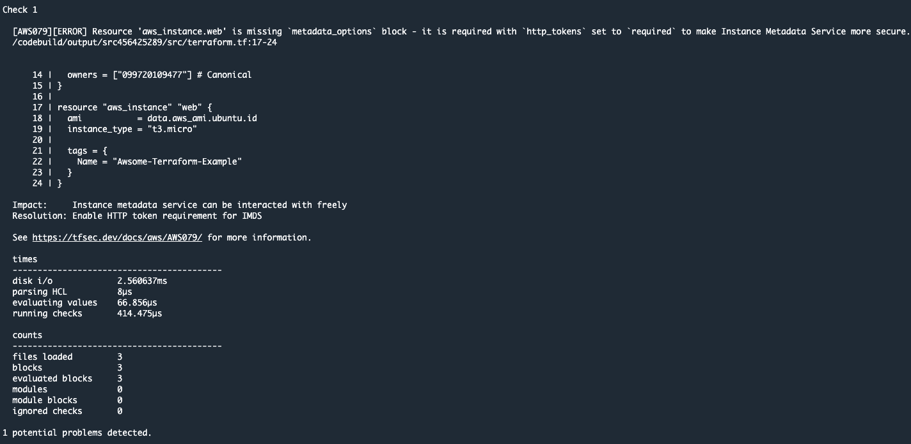
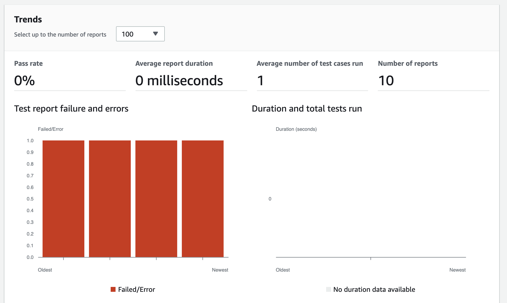
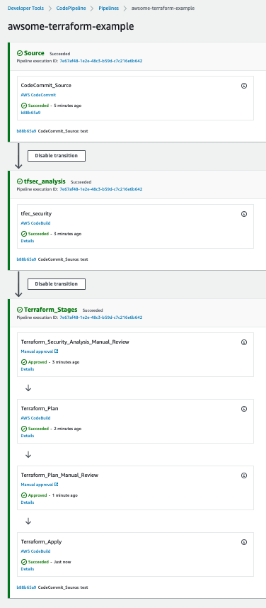

## CI/CD to secure and analyse your Terraform code using Amazon ECR, AWS CodeCommit, AWS CodePipeline, AWS CodeBuild and tfsec written in python using CDK!
The purpose of this repository is to demo how can we analyze and securize our Terraform code using a CI/CD Pipeline with a fully AWS services managed.

#### Requirements
  - CDK installed: [Getting started with the AWS CDK](https://docs.aws.amazon.com/cdk/latest/guide/getting_started.html) (Ensure the minimal version 1.103.0 to make it works)
  - AWS Account
  - IAM User or IAM role with permissions to create AWS Resources.
  - Git installed: [Git installation](https://git-scm.com/book/en/v2/Getting-Started-Installing-Git)
  - Clone this repo! : `git clone https://github.com/aws-samples/aws-cdk-tfsec`
  - Python CDK required libraries: (install with pip install -r requirements.txt)

### Architecture


###  Provisioning the infrastructure

First of all, we must to be sure that we have an IAM user or a role that could be assumed with permissions to create AWS Resources to create

We can start deploying the infrastructure using the CDK cli:

```
git clone https://github.com/aws-samples/aws-cdk-tfsec
cdk bootstrap aws://account_id/eu-west-1
cdk deploy --all
```
The infrastructure creation takes around 15/20 min due the AWS Codepipelines and references repository creation. In the meantime, you can clone the two new AWS CodeCommit repos that have been already created and push the example code. First one for the custom [Docker image](repos/docker_image) and later, for your [Terraform code](repos/terraform_code). 
Like this:
```
git clone https://git-codecommit.eu-west-1.amazonaws.com/v1/repos/awsome-terraform-example-container
git checkout -b main
cd awsome-terraform-example-container
cp -aR repos/docker_image/* .
git add .
git commit -am "First commit"
git push origin main
```
Once our Docker image is built and pushed to the Amazon ECR, we can proceed with our Terraform repo



Like this:
```
git clone https://git-codecommit.eu-west-1.amazonaws.com/v1/repos/awsome-terraform-example
git checkout -b main
cd awsome-terraform-example
cp -aR repos/terraform_code/* .
git add .
git commit -am "First commit"
git push origin main
```

### Check our Terraform Pipeline

During the pipeline execution, we can check the security checks pased to our tfsec configuration 



This configuration is running inside of an AWS Codebuild Container ith the configuration stated at [buildspec_tfsec](terraform_pipeline/terraform_pipeline_stack.py#L53-#L90). We highly recommend you to check the [tfsec documentation](https://tfsec.dev/docs/aws/home/) to review the configuration and modify as you need.

Besides this output, AWS Codebuild also exports the result of tfsec report on the Codebuild reports section



Our pipeline have several manual process:
- Manual process to review the security checks passed via tfsec.
- Manual process to review the Terraform plan output.



Bear in mind that AWS CodeBuild needs permissions to create AWS Resources. In this example, we have stated [ec2:*](terraform_pipeline/terraform_pipeline_stack.py#L144-#L152) permissions, but this must be modified based on the resources that we will need to create using Terraform. You can check the CDK code permissions (here)(terraform_pipeline/terraform_pipeline_stack.py)

###  Clean up
After completing your demo, delete your stack using the CDK cli:
```
cdk destroy --all
```

### Conclusion

At AWS, we work in the culture of security. This repository try to demonstrate how to build a CI/CD pipeline using AWS Services to automate and secure your infrastructure as code (IaC) for Terraform using [tfsec](https://tfsec.dev)


## Security

See [CONTRIBUTING](CONTRIBUTING.md#security-issue-notifications) for more information.

## License

This library is licensed under the MIT-0 License. See the LICENSE file.